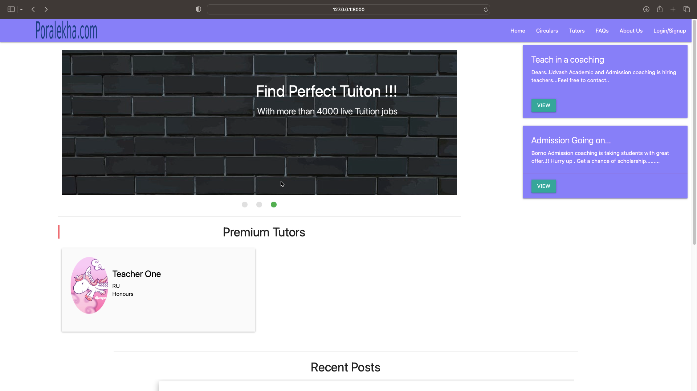
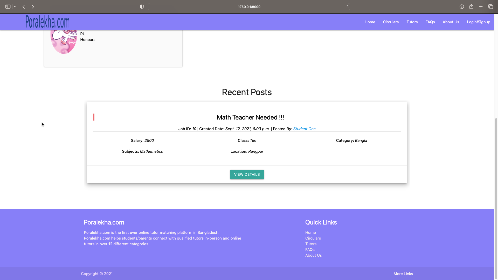
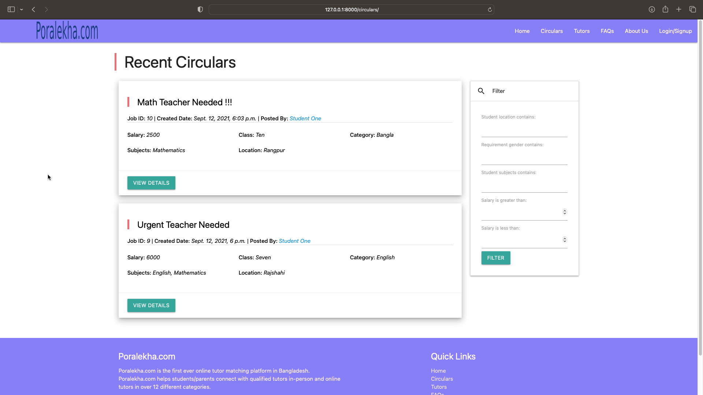
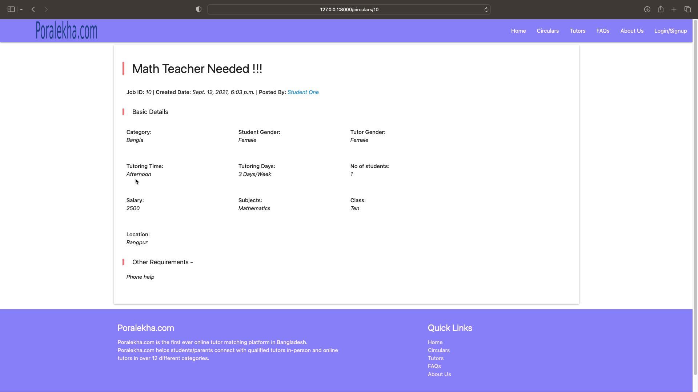
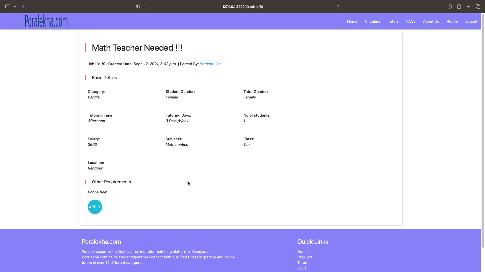
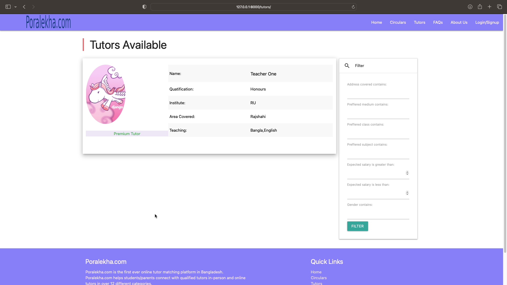
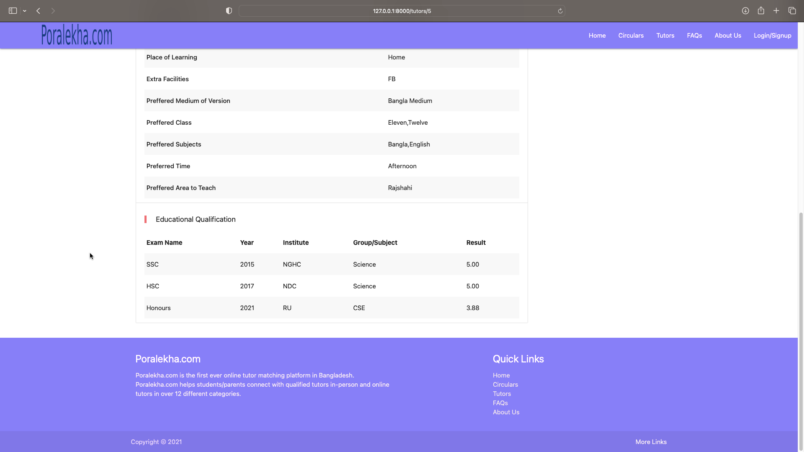

# Poralekha
This is a Django framework based web app. It is very similar to tutorsheba.com which is an online platform for finding tuition and tutors in Bangladesh.

# Overview
This is a tuition finding and tutor finding website. Here Anyone can register as a tutor or a student. Guest user without registration can view recent tuition posts list and details, tutor lists and details, student's details who posted the tuition post. Also, can filter tuition posts and tutor list.

Registered tutor can view tuition details and can apply for the tuition. Also, it is possible for the tutor to cancel running tuition contract via website. Tutor can send direct message in the student dashboard which will be sent as an email to student. Tutor can reset password, change or edit information about self.

User logged in as Student can Add, Delete or Modify Tuition post. Student can cancel tuition contract via website. Student can sent direct message to tutor. Student can reset password, change self information.

Also, premium teacher is made by some rating system. Student can give rating to teachers. Based on the rating teacher can be Premium.

## Homepage

Homepage consists of top menu, holding Website logo and navigation links. It is changed based on the guest or logged in users. Then a slider in the left side, and right side contains some ads.

The middle and lower part of the homepage contains information and featured list of premium tutors. A slider containing Recent tuition post.

## Circulars

Circulars page contains the list of the recent circulars. These circulars can be filtered based on some criteria.

Guest user only can view the circular details

Tutor can view the apply option in circular details page

Circular giver Student can modify, edit or delete this and view requests

## Tutors

Tutors page contains the list of all the tutors showing little information

Clicking on a tutor tutor details can be viewed

## Other pages

It also contains [login page](pics/login_page.png), [register page](pics/register.png), [password reset page](pics/pass_reset.png), [about us page](pics/about_us.png), Faqs page, [student details](pics/student_details.png), [tuition request notice page](pics/tuition_request.png).

Also, create circulars, admin panel has some functionalities...

# Frameworks Used
 - Django
 - Materialize CSS

# Required Libraries
 - django
 - django-crispy-forms
 - django-filters
 - pillow
